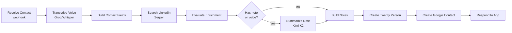

<p align="center">
  
</p>

<h1 align="center">PRM Tool</h1>

<p align="center">
  Capture a contact in seconds. The cloud does the rest.
</p>

<p align="center">
  <a href="https://github.com/luisKisters/prm-tool/releases/latest">
    
  </a>
  
  
</p>

---

A tiny Android app for personal relationship management. You meet someone, you tap the Quick Settings tile, you jot a name and a voice note, and you hit **Save & send**. A single webhook fires an [n8n](https://n8n.io) workflow that transcribes your voice memo, finds the person on LinkedIn, writes a clean CRM note, and files them in [Twenty](https://twenty.com) and Google Contacts. If you are offline, it queues and retries.

## Screens

<table>
  <tr>
    <td width="50%" valign="top">
      <br/>
      <b>Home</b><br/>
      Every captured contact with live send status (Sent / Failed) and one tap retry.
    </td>
    <td width="50%" valign="top">
      <br/>
      <b>New contact</b><br/>
      Name, company, number, a written note, and an attached voice memo.
    </td>
  </tr>
  <tr>
    <td width="50%" valign="top">
      <br/>
      <b>Tag and send</b><br/>
      Pick the event you met at and the lead source, then Save & send.
    </td>
    <td width="50%" valign="top">
      <br/>
      <b>Settings</b><br/>
      Your n8n webhook URL, events with date ranges, and custom sources.
    </td>
  </tr>
</table>

## Features

- **One tap capture** from the Quick Settings tile, no need to open the app.
- **Voice notes** recorded inline and sent with the contact.
- **Events and sources** you define once and reuse for fast tagging.
- **Offline first.** Contacts are stored locally (Room) and sent by a WorkManager job that retries on failure.
- **Material You.** Dynamic color on Android 12+, with a branded fallback palette below it.

## How it works

```
Android app  ──POST multipart──►  n8n webhook  ──►  Twenty CRM + Google Contacts
  (Compose)                       (transcribe,        (person record +
                                   enrich, summarize)   synced contact)
```

The app posts a `multipart/form-data` request to your n8n webhook with the contact fields plus the optional voice file:

```
firstName, lastName, company, number, note,
events, sources, clientId, createdAt, voice (audio/mp4)
```

n8n responds with JSON the app stores against the contact:

```json
{
  "status": "ok",
  "twentyContactUrl": "https://your-crm/object/person/<id>",
  "linkedinUrl": "https://linkedin.com/in/...",
  "summary": "Met at the founder dinner, building in fintech.",
  "googleContactId": "people/c123..."
}
```

## The n8n workflow

The full, importable workflow lives in [`n8n/add-contact.workflow.json`](n8n/add-contact.workflow.json).



Steps:

1. **Transcribe** the voice memo with Groq Whisper.
2. **Find** the person on LinkedIn with a Serper Google search.
3. **Summarize** the note and transcript with Kimi K2 (only when there is something to summarize).
4. **Create** the Twenty person, then a Google contact whose bio links back to the Twenty record.

It needs credentials for Groq, Serper, OpenRouter, Twenty, and Google Contacts. The Twenty person object also needs one custom field:

> **Field:** `Enriched` &nbsp;·&nbsp; **Type:** Multi-Select &nbsp;·&nbsp; **Object:** Person
> **Option values:** `EMAIL`, `PHONE`, `LINKEDIN`, `JOB_TITLE`, `CITY`, `COMPANY`, `AVATAR`

The workflow fills `Enriched` with whatever it managed to look up (for example `LINKEDIN`, `JOB_TITLE`). Phone numbers are split into Twenty's required parts (national number, calling code, ISO country) so the CRM accepts them.

<!-- Optional: drop a screenshot of the n8n canvas here -->
<!-- <p align="center"></p> -->

## Setup

1. Import `n8n/add-contact.workflow.json` into n8n and connect the five credentials.
2. Create the `Enriched` multi-select field in Twenty (values above).
3. Activate the workflow and copy its production webhook URL.
4. Install the app, open **Settings**, paste the URL, and add your events and sources.

## Build

```bash
./gradlew :app:assembleDebug
# output: app/build/outputs/apk/debug/app-debug.apk
```

Requires JDK 17 and the Android SDK (compileSdk 34, minSdk 26).
