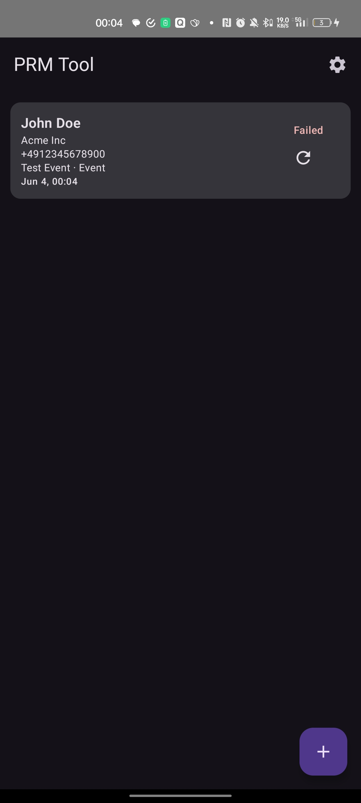
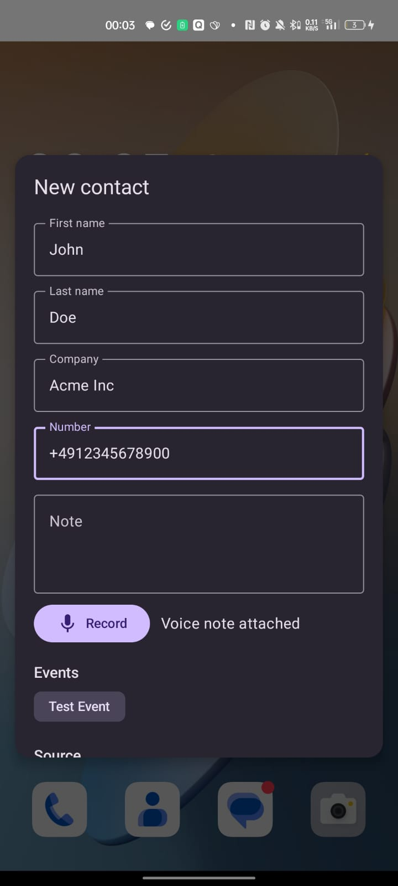
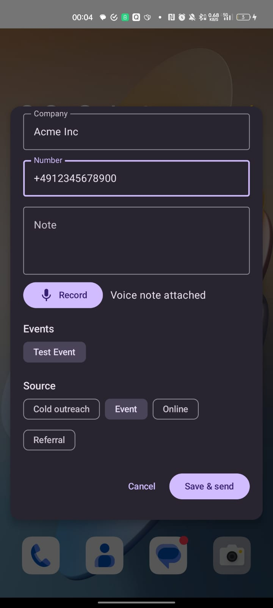
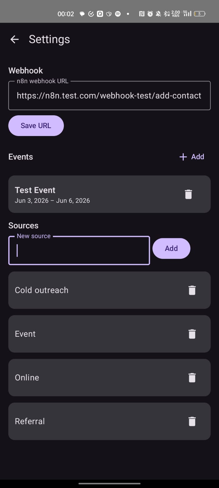

<p align="center">
  
</p>

<h1 align="center">PRM Tool</h1>

<p align="center">
  Capture a contact in seconds. The cloud does the rest.
</p>

<p align="center">
  <a href="https://github.com/luisKisters/prm-tool/releases/latest">
    
  </a>
  
  
</p>

---

A tiny Android app for personal relationship management. You meet someone, you tap the Quick Settings tile, you jot a name and a voice note, and you hit **Save & enrich**. A [Next.js](https://nextjs.org) backend on Vercel transcribes your voice memo, finds the person on LinkedIn, grabs their profile picture, resolves the company domain, and writes a clean summary. The app shows you everything it found; you **review and confirm** (editing anything that's off), and only then is the person filed in [Twenty](https://twenty.com) and Google Contacts. If you are offline, capture queues and enrichment runs as soon as you reconnect.

## Screens

<table>
  <tr>
    <td width="50%" valign="top">
      <br/>
      <b>Home</b><br/>
      Every captured contact with live send status (Sent / Failed) and one tap retry.
    </td>
    <td width="50%" valign="top">
      <br/>
      <b>New contact</b><br/>
      Name, company, number, a written note, and an attached voice memo.
    </td>
  </tr>
  <tr>
    <td width="50%" valign="top">
      <br/>
      <b>Tag and send</b><br/>
      Pick the event you met at and the lead source, then Save & send.
    </td>
    <td width="50%" valign="top">
      <br/>
      <b>Settings</b><br/>
      Your n8n webhook URL, events with date ranges, and custom sources.
    </td>
  </tr>
</table>

## Features

- **One tap capture** from the Quick Settings tile, no need to open the app.
- **Voice notes** recorded inline and sent with the contact.
- **Events and sources** you define once and reuse for fast tagging.
- **Live LinkedIn re-fetch.** Edit the LinkedIn URL on the review screen and the photo + headline re-resolve for that exact profile (or clear, if it can't be found).
- **Offline first.** Contacts are stored locally (Room) and sent by a WorkManager job that retries on failure.
- **Material You.** Dynamic color on Android 12+, with a branded fallback palette below it.

## How it works

```
                     ┌──────────────── POST /api/enrich (multipart) ───────────────┐
Android app  ───────►│  Vercel backend (Next.js)                                   │
  (Compose)          │   transcribe (Groq) · LinkedIn + avatar + domain (Serper)   │
     ▲               │   summarize (Kimi K2.6 / OpenRouter)  — no writes           │
     │  enriched     └─────────────────────────────────────────────────────────────┘
     │  data
  Review & confirm (edit anything)
     │
     └──────────────► POST /api/commit ──► Twenty CRM person + Google Contact
                        (idempotent on the stable PRM ID, stored in both)
```

The flow is two steps:

1. **Enrich** (`POST /api/enrich`, `multipart/form-data`) — read-only. The app sends the captured
   fields + optional voice file; the backend returns what it found, **without writing anywhere**:

   ```
   firstName, lastName, company, number, note, events, sources, clientId, createdAt, voice (audio/mp4)
   ```
   ```json
   {
     "prmId": "…", "transcript": "…",
     "linkedinUrl": "https://linkedin.com/in/…", "headline": "Founder at …",
     "avatarUrl": "https://…", "companyDomain": "acme.com",
     "summary": "Met at the founder dinner, building in fintech.",
     "enriched": ["LINKEDIN", "JOB_TITLE", "AVATAR", "COMPANY"]
   }
   ```

2. **Commit** (`POST /api/commit`, `application/json`) — after you confirm in the review screen, the
   backend upserts the Twenty person and creates the Google contact, then returns the IDs:

   ```json
   { "prmId": "…", "twentyId": "…", "twentyUrl": "https://crm…/object/person/…", "googleResourceName": "people/c…" }
   ```

Between the two, editing the LinkedIn URL in the review screen calls a small read-only helper that
re-derives the photo and headline for *that* profile (debounced; blank when it can't be resolved):

   - **LinkedIn lookup** (`POST /api/linkedin`, `application/json`) — `{ "url": "…", "name": "…" }`
     → `{ "linkedinUrl": "…", "headline": "…", "avatarUrl": "…" }`.

### The stable PRM ID

Every contact carries a `prmId` (a UUID generated on capture). It is written to **both** systems —
a `prmId` custom field on the Twenty person, and a **PRM ID** `userDefined` field on the Google
contact (visible as a custom field in the Google Contacts UI). Because the identifier is independent
of the name and notes, the person stays identifiable after you rename or edit them — and commit is
**idempotent**: re-running it finds the existing Twenty person by `prmId` and updates rather than
duplicating.

## The backend

A stateless Next.js (App Router) API under [`backend/`](backend/), deployed to Vercel. It has no
database — the Android app (Room) is the source of truth and carries the enrichment between the two
calls. Phone numbers are split into Twenty's required parts (national number, calling code, ISO
country) before they're sent.

It needs these environment variables (see [`backend/.env.example`](backend/.env.example)):

| Variable | Purpose |
| --- | --- |
| `APP_API_SECRET` | Shared bearer token the app sends; gates every endpoint |
| `GROQ_API_KEY` | Voice transcription (`whisper-large-v3`) |
| `SERPER_API_KEY` | LinkedIn URL + avatar (`/images`) + company domain (knowledge graph) + per-profile re-fetch |
| `OPENROUTER_API_KEY` | Note summary; model `OPENROUTER_MODEL` defaults to `moonshotai/kimi-k2.6` |
| `TWENTY_API_KEY`, `TWENTY_BASE_URL` | Twenty CRM REST API |
| `GOOGLE_CLIENT_ID`, `GOOGLE_CLIENT_SECRET`, `GOOGLE_REFRESH_TOKEN` | Google People API |

The Twenty Person object needs two custom fields:

> **`prmId`** &nbsp;·&nbsp; Type: **Text** &nbsp;— the stable identifier (created automatically if you use the bundled tooling).
> **`Enriched`** &nbsp;·&nbsp; Type: **Multi-Select** &nbsp;·&nbsp; values `EMAIL`, `PHONE`, `LINKEDIN`, `JOB_TITLE`, `CITY`, `COMPANY`, `AVATAR`.

> The previous [n8n workflow](n8n/add-contact.workflow.json) is kept for reference but is **deprecated** — the Next.js backend replaces it.

## Setup

**Backend (Vercel):**

1. `cd backend && pnpm install`.
2. Create an OAuth 2.0 *Desktop app* client in Google Cloud, enable the **People API**, then run
   `GOOGLE_CLIENT_ID=… GOOGLE_CLIENT_SECRET=… pnpm google-auth` and copy the printed refresh token.
3. Import `backend/` as a Vercel project (set **Root Directory** to `backend`) and add the env vars above.
4. Ensure the Twenty `prmId` (Text) and `Enriched` (Multi-Select) fields exist on Person.

**App:**

5. Install the APK, open **Settings**, paste the **API base URL** (your Vercel URL) and the **API
   secret token** (`APP_API_SECRET`), and add your events and sources.

## Build

```bash
# Android app
./gradlew :app:assembleDebug
# output: app/build/outputs/apk/debug/app-debug.apk

# Backend
cd backend && pnpm install && pnpm build
```

App requires JDK 17 and the Android SDK (compileSdk 34, minSdk 26). Backend requires Node 18+.
